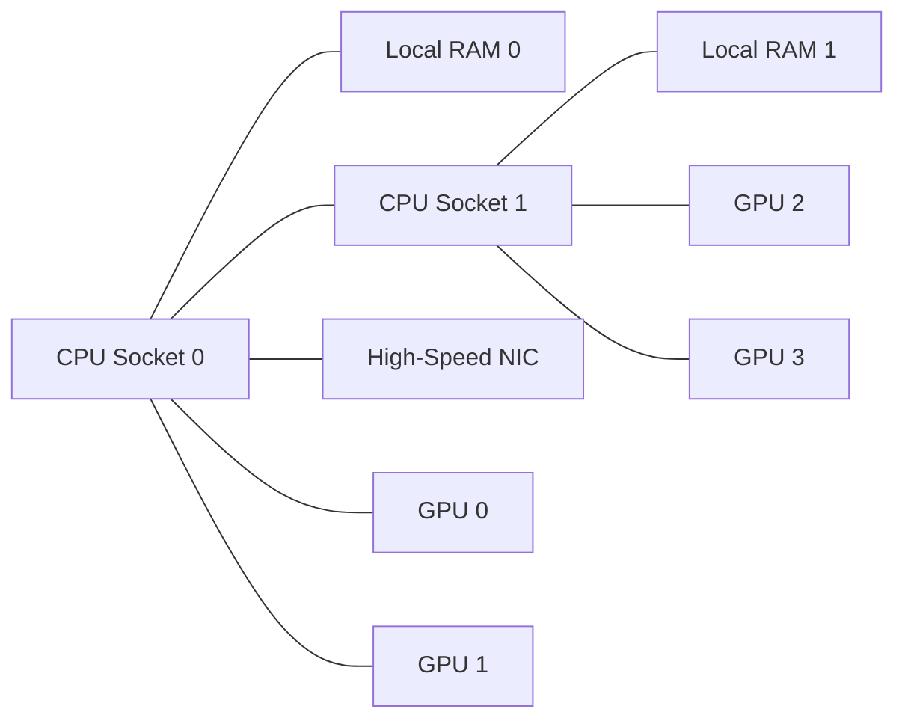
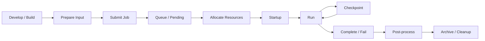

# HPC Foundations.md

> Here are practical foundations for DevOps / SRE engineers who are new to High Performance Computing (HPC).

- [1. What is HPC](#1-what-is-hpc)
- [2. HPC Datacenter Architecture](#2-hpc-datacenter-architecture)
- [3. HPC Compute Architecture](#3-hpc-compute-architecture)
- [4. HPC Networking (Ethernet vs InfiniBand, RDMA)](#4-hpc-networking-ethernet-vs-infiniband-rdma)
- [5. HPC Storage (Lustre, BeeGFS, NFS)](#5-hpc-storage-lustre-beegfs-nfs)
- [6. NVIDIA GPU Architecture](#6-nvidia-gpu-architecture)
- [7. HPC Job Scheduling (Slurm)](#7-hpc-job-scheduling-slurm)
- [8. Typical HPC workload lifecycle](#8-typical-hpc-workload-lifecycle)
- [Reference architecture: putting it all together](#reference-architecture-putting-it-all-together)
- [What DevOps / SRE engineers should focus on first](#what-devops--sre-engineers-should-focus-on-first)

---

## 1. What is HPC

High Performance Computing (HPC) is the practice of running compute-intensive workloads across many CPU cores, nodes, and often GPUs to solve problems faster than a single server could.

HPC is used for:
- Scientific simulation
- Weather and climate modeling
- Computational fluid dynamics
- Genomics
- AI training and inference
- Financial risk analysis
- Electronic design automation
- Rendering and media pipelines

### How HPC differs from typical cloud / web systems

A DevOps or SRE engineer coming from web infrastructure usually optimizes for:
- Availability
- Horizontal scaling of stateless services
- Latency for user requests
- API reliability
- Elastic autoscaling

HPC usually optimizes for:
- Time-to-solution
- Maximum throughput for batch jobs
- Efficient parallel execution
- Low-latency, high-bandwidth inter-node communication
- High-performance shared storage
- Fair scheduling of scarce compute resources

### Key idea

In web systems, many users send many independent requests.

In HPC, one user job may consume:
- 1 node
- 100 nodes
- 1000 nodes
- CPUs only, or CPUs + GPUs
- Large memory
- Fast network collectives
- Shared parallel file systems

### Common HPC terms

| Term | Meaning |
|--- |---|
| Cluster | A group of connected servers used as one compute platform |
| Node | One server in the cluster |
| Core | A CPU execution unit |
| Accelerator | Usually a GPU, sometimes FPGA or other device |
| Job | A batch submission requesting resources |
| Queue / Partition | A logical grouping of resources in the scheduler |
| MPI | Message Passing Interface, standard for distributed parallel programs |
| RDMA | Remote Direct Memory Access for low-latency data transfer |
| Parallel file system | Shared storage optimized for many clients and high throughput |


---

## 2. HPC Datacenter Architecture

An HPC datacenter is designed around large-scale compute, high power density, fast east-west networking, and storage that can feed thousands of processes.

### Typical layers

- User access layer
- Management / control plane
- Login nodes
- Scheduler and cluster services
- Compute nodes
- High-speed fabric
- Shared storage
- Monitoring and observability
- Power and cooling infrastructure

### Real production architecture pattern

A common production HPC environment includes:

- **Login nodes**
  - Where users SSH in
  - Used for code compilation, small tests, job submission
  - Not for heavy compute

- **Management nodes**
  - Provisioning
  - Configuration management
  - Monitoring
  - Authentication
  - Image distribution

- **Scheduler controllers**
  - Slurm controller, accounting database
  - Queue management
  - Resource allocation

- **Compute nodes**
  - CPU-only nodes
  - GPU nodes
  - Large-memory nodes
  - Specialized nodes for storage or visualization

- **Storage servers**
  - Parallel file system metadata servers
  - Object storage servers
  - NFS export systems for home directories
  - Archive systems

- **Network tiers**
  - Management Ethernet
  - Storage network
  - High-speed compute fabric such as InfiniBand or RoCE Ethernet

### Datacenter design concerns

#### Power

HPC nodes, especially GPU nodes, consume a lot of power.
- CPU node: a few hundred watts to over 1 kW
- 8-GPU node: often 5 to 10+ kW
- Rack-level power planning is critical

#### Cooling

Air cooling may be enough for smaller clusters, but modern GPU clusters often use:
- Rear-door heat exchangers
- Direct liquid cooling
- Immersion cooling in some designs

#### Rack density

HPC often packs dense compute into racks, unlike general enterprise infrastructure.

#### Failure domains

You design for:
- Rack failures
- Switch failures
- Storage target failures
- Node drain / replacement
- Graceful job rescheduling

### SRE viewpoint

As an SRE, think in terms of:
- Control plane health
- Scheduler availability
- Node state management
- Capacity planning
- Storage saturation
- Fabric congestion
- User isolation
- Fair-share and multi-tenancy
- Job failure attribution

---

## 3. HPC Compute Architecture

HPC compute architecture is about how compute nodes are built and how parallel programs use them.

### Node types

#### CPU-only nodes

Best for:
- Traditional MPI codes
- Many scientific simulations
- Pre/post-processing
- Workloads not GPU-optimized

Typical design:
- 1 or 2 sockets
- 32 to 128+ cores per node
- Large RAM capacity
- High-speed NIC

#### GPU nodes

Best for:
- AI / ML training
- Molecular dynamics
- Accelerated simulation
- CUDA/OpenACC applications

Typical design:
- 1 or 2 CPUs
- 4 to 8 GPUs
- PCIe or NVLink / NVSwitch
- Large power and cooling envelope

#### Large-memory nodes

Best for:
- In-memory databases
- Genome assembly
- Graph analytics
- Memory-bound serial or threaded workloads

### CPU architecture concepts important in HPC

- **Sockets**: physical CPU packages
- **Cores**: execution units
- **Threads**: hardware threads, often SMT/Hyper-Threading
- **NUMA**: non-uniform memory access; memory closer to one CPU socket is faster for that socket
- **Cache hierarchy**: L1, L2, L3 caches matter for locality
- **Vector instructions**: AVX2, AVX-512, SVE accelerate math-heavy code

### Why NUMA matters

A dual-socket node may have memory attached to each socket. If a process runs on socket 0 but constantly accesses memory on socket 1, performance drops.

Practical operations implications:
- Pin tasks to cores
- Respect NUMA boundaries
- Use scheduler settings to control CPU and memory affinity

### Example node layout




---

## 4. HPC Networking (Ethernet vs InfiniBand, RDMA)

Networking is often the difference between an HPC cluster that scales well and one that does not.

### Why networking matters more in HPC

Many HPC applications exchange data constantly:
- MPI collectives
- Halo exchanges
- Gradient synchronization in distributed training
- Checkpoint coordination

If network latency is high or bandwidth is low, scaling collapses.

### Key network metrics

- **Bandwidth**: how much data per second can be transferred
- **Latency**: how long it takes a message to start arriving
- **Jitter**: variability in latency
- **Congestion**: contention from oversubscription or hot spots

### Ethernet in HPC

Ethernet is common because it is:
- Widely available
- Easier to operate
- Often cheaper
- Good for management, storage, and moderate-scale compute

Modern Ethernet options:
- 25/50/100/200/400 GbE
- RoCE for RDMA over Converged Ethernet

Ethernet works well for:
- Small to mid-sized clusters
- Loosely coupled jobs
- AI clusters with carefully designed RoCE fabrics
- Storage and management networks

### InfiniBand in HPC

InfiniBand is purpose-built for high-performance low-latency communication.

Benefits:
- Very low latency
- High bandwidth
- Mature RDMA support
- Efficient MPI performance
- Strong support in large scientific clusters and GPU supercomputers

Used for:
- Tightly coupled MPI jobs
- Large-scale simulation
- Multi-node GPU training
- Systems where every microsecond matters

### RDMA

RDMA allows one host to access memory on another host directly, with minimal CPU involvement.

Benefits:
- Lower CPU overhead
- Lower latency
- Higher throughput
- Better performance for MPI and storage traffic

Think of it as bypassing much of the normal network software path.

### Ethernet vs InfiniBand summary

| Feature | Ethernet | InfiniBand |
|--- |---|---|
| Cost | Usually lower | Usually higher |
| Operational familiarity | High | Lower outside HPC |
| Latency | Good to moderate | Excellent |
| MPI scaling | Good with tuning | Excellent |
| RDMA support | RoCE / iWARP | Native |
| Typical use | General networking, storage, smaller clusters, AI fabrics | Large HPC, tightly coupled MPI, top-tier GPU clusters |

### RoCE considerations

RoCE can provide RDMA over Ethernet, but it often requires careful tuning:
- Lossless fabric behavior
- Priority flow control
- ECN
- Congestion management
- Consistent switch configuration

Operationally, RoCE can be more fragile if not engineered carefully.

### Common topologies

#### Leaf-spine

**Leaf-spine** is a datacenter network topology designed for **high bandwidth, low latency, and predictable east-west traffic** between servers.

- **Leaf switches** connect directly to servers/nodes
- **Spine switches** connect to all leaf switches
- Leaf switches usually do **not** connect to other leaf switches
- Spine switches usually do **not** connect to endpoints directly

So traffic typically goes:

**Server → Leaf → Spine → Leaf → Server**

##### Why it is used

Leaf-spine is popular in HPC, AI, and modern datacenters because it provides:

- **Consistent hop count** between nodes
- **High east-west bandwidth**
- **Better scaling** than traditional hierarchical designs
- **More predictable performance**
- Easier design for **low oversubscription** or near **non-blocking fabric**

This matters in HPC because nodes often talk heavily to each other, not just to the internet or users.

##### Difference from “traditional topology”

What people usually mean by “traditional topology” is a **traditional 3-tier network**:

- **Access**
- **Aggregation / Distribution**
- **Core**

This model was common in enterprise IT and web environments.

#### Traditional topology characteristics

- Built more for **north-south traffic**
  - client ↔ server
  - user ↔ app
  - app ↔ internet
- Traffic between servers may need to go through more layers
- Can create bottlenecks and oversubscription
- Less ideal when many nodes need to communicate with each other continuously

#### Leaf-spine characteristics

- Built for **east-west traffic**
  - server ↔ server
  - node ↔ node
  - MPI / distributed training / cluster communication
- Every leaf has direct paths through the spine layer to every other leaf
- Usually lower and more uniform latency
- Easier to scale horizontally by adding more leafs/spines

#### Simple comparison

| Feature                  | Leaf-spine                | Traditional topology                      |
| ------------------------ | ------------------------- | ----------------------------------------- |
| Main traffic pattern     | East-west                 | North-south                               |
| Hop consistency          | Very consistent           | Less consistent                           |
| Latency between servers  | Lower / more predictable  | Often higher / less predictable           |
| Scalability              | Excellent for datacenters | More limited for server-to-server traffic |
| Oversubscription control | Easier to design near 1:1 | More common bottlenecks                   |
| HPC suitability          | Very good                 | Often poor to moderate                    |

#### Why leaf-spine matters in HPC

In HPC, jobs often run across many nodes and exchange data constantly.

Examples:
- MPI collectives
- distributed GPU training
- simulation halo exchange

If the network is a traditional oversubscribed design, performance can collapse.

Leaf-spine helps by giving:
- more parallel paths
- more predictable bandwidth
- lower congestion risk
- better scaling for tightly coupled workloads

### Oversubscription

Oversubscription is when more devices or workloads compete for a shared resource than that resource can handle at full speed.

In HPC, it usually means the network fabric does not provide full bandwidth between all nodes at the same time. For example, many compute nodes may connect to an uplink that has less total capacity than the sum of their links.

Why it matters:
- In web systems, some oversubscription is often acceptable because traffic is bursty.
- In HPC, tightly coupled jobs like MPI often need frequent node-to-node communication.
- If the network is oversubscribed, contention increases, latency rises, and job performance can drop sharply.

Example:
- 10 nodes each have 100 Gbps links = 1,000 Gbps total edge bandwidth
- But the switch uplink provides only 400 Gbps
- That is oversubscription

In practice, HPC clusters often aim for:
- 1:1 or near 1:1 bandwidth in the compute fabric
- non-blocking or predictable east-west communication paths

So, oversubscription = too many consumers sharing too little capacity, especially in the network.
In web environments, some oversubscription is often acceptable.

In HPC, oversubscription can destroy MPI performance. Large clusters often aim for:
- 1:1 or near 1:1 for the compute fabric
- Predictable non-blocking paths for east-west traffic

---

## 5. HPC Storage (Lustre, BeeGFS, NFS)

HPC storage is not just about capacity. It is about delivering high throughput to many clients at once.

### Storage tiers commonly found in HPC

- **Home directories**
  - Usually smaller
  - User config, scripts, source code
  - Often NFS-backed

- **Project / shared data**
  - Team datasets
  - May live on parallel storage

- **Scratch**
  - High-performance temporary workspace
  - Large capacity
  - Purge policies often apply

- **Archive**
  - Long-term retention
  - Lower performance
  - Tape or object storage behind gateways

### NFS

NFS is simple and widely used.

Good for:
- Home directories
- Small shared directories
- Software trees
- Lightweight metadata-oriented access

Not ideal for:
- Very high concurrency
- Massive parallel I/O
- Thousands of MPI ranks reading/writing large files simultaneously

### Lustre

Lustre is a widely used parallel file system in HPC.

Key components:
- **MDS/MDT**: metadata server / target
- **OSS/OST**: object storage server / targets
- Clients access data in parallel across multiple OSTs

Strengths:
- Excellent throughput at scale
- Common in large scientific HPC clusters
- Good for large sequential I/O

Tradeoffs:
- Operational complexity
- Metadata-heavy small-file workloads can still be painful
- Tuning matters

### BeeGFS

BeeGFS is another parallel file system popular in HPC.

Strengths:
- Flexible and often easier to deploy
- Good performance
- Good scaling for many environments
- Popular in research and enterprise HPC

Tradeoffs:
- Design and tuning still matter
- Real performance depends on backend storage and network

### Comparison

| Storage | Best for | Strengths | Weaknesses |
|--- |---|---|---|
| NFS | Home dirs, light shared use | Simple, familiar | Poor at large-scale parallel I/O |
| Lustre | Large-scale HPC scratch/project data | High throughput, mature HPC use | More operational complexity |
| BeeGFS | Mid-to-large HPC environments | Flexible, strong performance | Still requires careful design |

### Important storage concepts for SREs

#### Metadata vs data

It means HPC storage gets stressed in different ways depending on the I/O pattern:

- **Small file workloads stress metadata servers**
  - When users create, open, close, rename, list, or delete lots of small files, the system spends much of its time handling **metadata** operations.
  - Metadata is information *about* files: filename, permissions, timestamps, directory entries, where blocks live, etc.
  - In parallel file systems like Lustre, this work often hits the **metadata server (MDS)**.
  - Example: a job producing millions of tiny log files can overload metadata handling even if total data volume is small.

- **Large sequential writes stress throughput targets**
  - When jobs write very large files in long continuous streams, the main challenge is moving lots of data fast enough.
  - That stresses the **data path**: storage targets, object storage servers, disks/SSDs, network bandwidth.
  - In Lustre terms, this is more about **OSTs/OSSs** than the metadata server.
  - Example: a simulation writing 500 GB checkpoint files is mostly a throughput problem.

##### Simple mental model

- **Lots of tiny files** → “Can the filesystem keep up with file operations?”
- **Huge streaming files** → “Can the filesystem deliver enough bandwidth?”

So the sentence is highlighting that **metadata performance and bulk data throughput are different bottlenecks** in HPC storage.

#### Striping

Parallel file systems can stripe files across many storage targets.

This improves throughput for large files, but over-striping can waste resources.

#### Scratch discipline

**Scratch** means **scratch storage/filesystem**: a **high-performance temporary workspace** in an HPC environment where jobs read/write active data during execution.

In this note, it implies storage that is:

- **Fast**: optimized for throughput
- **Shared**: used by many users/jobs
- **Temporary**: not meant for long-term or permanent storage

So users should treat scratch as a place for:
- job inputs staged for runs
- intermediate files
- checkpoints
- temporary outputs

And **not** as a safe permanent home for important data, because it may have **purge/cleanup policies**.

#### Checkpoint I/O

This is describing a common HPC storage problem during **checkpointing**.

A **checkpoint** is a saved snapshot of a running job’s state so the job can restart later after:
- a failure
- a maintenance event
- a time-limit stop
- a preemption

For large HPC jobs, checkpoint files can be very big. If **many jobs write checkpoints at the same time**, they all hit shared storage together. That can overwhelm the filesystem and network, causing an **I/O storm**. “Storage can melt down” means performance collapses: writes slow dramatically, metadata/data servers get overloaded, and other jobs may also suffer.

### Mitigations

- **Stagger checkpoints**
  - Avoid having every job save at the same interval boundary.
  - Example: instead of all jobs checkpointing every hour on the hour, offset them across time.

- **Burst buffers**
  - Write checkpoints first to a fast intermediate layer, often SSD/NVMe-based.
  - Data can be drained to the main shared filesystem later, smoothing the load.

- **Node-local storage**
  - Save checkpoints to local disk/NVMe on each compute node instead of immediately writing everything to shared storage.
  - This reduces pressure on the central filesystem, though recovery and durability need planning.

- **Scheduler-aware checkpoint windows**
  - The scheduler coordinates when jobs are allowed or encouraged to checkpoint.
  - This spreads checkpoint traffic over controlled time windows instead of letting it happen all at once.

#### Simple mental model

- **Checkpointing** = safety save for long jobs
- **Too many simultaneous saves** = shared storage traffic jam
- **Mitigations** = spread out, buffer, or localize the writes

### Practical production pattern

A common setup:
- NFS for `/home`
- Lustre or BeeGFS for `/scratch`
- Object store or tape for archive

---

## 6. NVIDIA GPU Architecture

Modern HPC increasingly depends on GPUs, especially for AI and accelerated simulation.

### Why GPUs matter

GPUs provide massive parallelism for workloads with many similar operations:
- Matrix math
- Vector operations
- Deep learning
- Particle simulation
- FFTs
- Linear algebra

### Core GPU concepts

#### Streaming Multiprocessors (SMs)

An NVIDIA GPU contains many SMs.
Each SM runs many threads in parallel.

#### CUDA cores

These execute general arithmetic operations.

#### Tensor cores

Specialized units for matrix operations, especially useful for AI and mixed-precision HPC math.

#### HBM

High Bandwidth Memory provides very high memory bandwidth compared with normal system RAM.

#### Device memory

GPU memory is separate from CPU memory.
Data movement between CPU RAM and GPU memory must be managed carefully unless unified models are used.

### GPU execution model

Programs launch **kernels**.
A kernel runs many threads organized into:
- Grids
- Blocks
- Threads

Performance depends on:
- Occupancy
- Memory access patterns
- Coalesced reads/writes
- Shared memory use
- Minimizing host-device transfers

### Multi-GPU communication

Inside a node, GPUs may communicate using:
- PCIe
- NVLink
- NVSwitch

Between nodes, GPUs communicate through the network via:
- GPUDirect RDMA
- InfiniBand or RoCE

### Why topology matters

Not all GPUs are equally close to each other or to the NIC.
Application performance can depend heavily on:
- Which GPU is paired with which NIC
- NUMA locality
- PCIe switch layout
- NVLink connectivity


### Practical concerns for SRE / platform teams

- NVIDIA driver lifecycle
- CUDA compatibility
- Container runtime integration
- GPU telemetry
- MIG on supported GPUs
- ECC error monitoring
- Thermal throttling
- Power caps
- Fabric Manager on NVSwitch systems

### MIG

MIG = Multi-Instance GPU.

It allows one physical GPU to be partitioned into smaller isolated GPU instances.

Useful for:
- Multi-tenant inference
- Small development jobs
- Better utilization in some environments

Less ideal for:
- Large tightly coupled training jobs needing the full GPU

### Production example

An 8-GPU training node might have:
- 2 CPUs
- 8 NVIDIA GPUs
- NVSwitch interconnect
- 2 high-speed NICs
- 1-2 TB RAM
- Local NVMe scratch

A distributed training job may run:
- 8 GPUs per node
- 32 nodes total
- NCCL over InfiniBand
- Shared checkpoint storage on Lustre/BeeGFS

---

## 7. HPC Job Scheduling (Slurm)

Slurm is the most common scheduler in modern HPC.

It allocates resources and launches jobs safely and fairly across the cluster.

### What Slurm does

- Accepts batch jobs
- Allocates nodes, CPUs, memory, GPUs
- Enforces limits
- Tracks usage
- Supports priorities and fair-share
- Manages partitions / queues
- Handles node states

### Key Slurm components

| Component | Purpose |
|--- |---|
| slurmctld | Central controller |
| slurmd | Agent on each compute node |
| slurmdbd | Accounting database service |
| sinfo | View cluster partitions and node states |
| squeue | View queued/running jobs |
| sbatch | Submit a batch job |
| srun | Launch tasks |
| scancel | Cancel jobs |

### Common concepts

#### Partition

A **partition** in HPC/Slurm is a **named pool of resources that also acts like a queue**.

It is used to separate jobs by **hardware type**, **policy**, or **intended use**.

Examples:
- `cpu` → regular CPU nodes
- `gpu` → nodes with GPUs
- `debug` → short test jobs
- `highmem` → nodes with lots of RAM

When a user submits a job, they often choose a partition, such as:

```bash
#SBATCH --partition=gpu
```

That tells the scheduler:
- which set of nodes the job can run on
- what rules may apply there
  - time limits
  - priority
  - access restrictions
  - resource limits

So, a simple way to think about it is:

**Partition = scheduler-defined resource group + queue for a specific class of jobs.**

#### Job

**Job** means a **user-submitted unit of work that asks the HPC scheduler for compute resources**.

So “a user request for resources” typically means the user is requesting things like:

- number of nodes
- CPU cores
- memory
- GPUs
- wall-clock time
- sometimes a specific partition/queue

In practice, a job is usually:
- a batch script submitted to Slurm with `sbatch`, or
- an interactive request with `srun`

The scheduler then decides **when** and **where** that job can run based on available resources and policy.

#### Allocation

**allocation** means the set of compute resources the scheduler has **assigned to a job** so it can run.

That can include things like:

- specific **nodes**
- number of **CPU cores**
- amount of **memory**
- **GPUs**
- a **time limit**

So the difference is:

- **Job** = the user's request for resources
- **Allocation** = the resources the scheduler actually grants to that job

Example:
If a user requests **2 GPU nodes, 16 CPUs per node, and 8 hours**, the allocation is those granted nodes/CPUs/GPUs/time once Slurm schedules the job.

#### Fair-share

Users or groups with less recent usage may get higher priority.

#### QoS

Quality of Service policies for:
- Limits
- priority
- preemption
- maximum job time
- job count

### Example Slurm batch script

```bash
#!/bin/bash
#SBATCH --job-name=mpi-test
#SBATCH --partition=cpu
#SBATCH --nodes=4
#SBATCH --ntasks-per-node=64
#SBATCH --time=02:00:00
#SBATCH --output=slurm-%j.out

module load openmpi
srun ./my_mpi_app
```

### GPU job example

```bash
#!/bin/bash
#SBATCH --job-name=train
#SBATCH --partition=gpu
#SBATCH --nodes=2
#SBATCH --gpus-per-node=8
#SBATCH --ntasks-per-node=8
#SBATCH --cpus-per-task=8
#SBATCH --time=08:00:00
#SBATCH --output=slurm-%j.out

module load cuda
srun python train.py
```

### Operational realities

#### Scheduler is a critical control plane

If `slurmctld` is unhealthy:
- Jobs cannot be scheduled
- User confidence drops immediately
- Operational noise increases fast

#### Node states matter

These are common **Slurm node states**:

- **idle**  
  The node is available and not currently running any jobs.

- **alloc**  
  The node is fully allocated to one or more jobs. Slurm has assigned its resources and it is in use.

- **drain**  
  The node is marked so that **no new jobs will be scheduled onto it**, usually because of maintenance or a detected problem. Existing jobs may be allowed to finish, depending on how it was drained.

- **down**  
  The node is unavailable to the scheduler, typically because it is offline, unreachable, or intentionally taken out of service.

- **fail**  
  The node has failed or is in a failed state, usually due to a serious hardware, software, or health-check issue.

- **mix**  
  The node is **partially allocated**: some of its resources are in use by jobs, but some are still free.

A simple way to think about them:

- **idle** = free  
- **alloc** = fully busy  
- **mix** = partially busy  
- **drain** = do not place new work here  
- **down** = unavailable  
- **fail** = broken / unhealthy

SREs often spend time debugging why nodes are draining:
- hardware faults
- health checks
- GPU errors
- filesystem mount failures
- bad firmware
- broken images

#### Backfill scheduling

Slurm can fit smaller jobs into gaps while waiting for large reservations.

This improves utilization without blocking large jobs forever.

### Slurm ecosystem concerns

- Authentication integration
- Accounting retention
- HA design for controller services
- Config management for nodes
- cgroups enforcement
- GPU resource accounting
- federation or multi-cluster designs

### Example user workflow

- User logs into login node
- Prepares batch script
- Runs `sbatch job.sh`
- Slurm queues the job
- Resources become available
- Slurm launches tasks on assigned nodes
- User checks status with `squeue`
- Results written to scratch or project storage

---

## 8. Typical HPC workload lifecycle

Understanding the workload lifecycle helps SREs map system behavior to user experience.

### Stage 1: Code development

Users:
- Write code
- Compile software
- Build containers
- Test on small datasets

Typical systems involved:
- Login nodes
- Build nodes
- package/module system
- source repositories

### Stage 2: Input preparation

Users prepare:
- Configuration files
- Datasets
- Meshes
- Parameters
- Training manifests

Storage implications:
- Reads from home or project storage
- Writes staged into scratch

### Stage 3: Job submission

User creates a Slurm script and submits it.

At this point:
- Scheduler validates request
- Priority is computed
- Job enters pending state if resources are unavailable

### Stage 4: Queue wait

The job may wait because of:
- Resource shortage
- Partition limits
- QoS constraints
- Fair-share policy
- Maintenance windows

This is often where users think “the cluster is slow,” even when compute is healthy.

### Stage 5: Resource allocation

Slurm allocates:
- Nodes
- CPU cores
- Memory
- GPUs
- Time limit

The job is placed on matching nodes.

### Stage 6: Job startup

Startup may include:
- Mounting filesystems
- Loading modules
- Pulling container images
- Launching MPI runtime
- Initializing NCCL / CUDA
- Reading input datasets

Operational bottlenecks often appear here:
- Metadata storms
- image pull bottlenecks
- module misconfiguration
- network startup issues

### Stage 7: Execution

The main compute phase runs.

This may be:
- CPU-bound
- GPU-bound
- memory-bound
- network-bound
- storage-bound

Monitoring should cover:
- CPU utilization
- GPU utilization
- memory pressure
- interconnect health
- filesystem throughput
- application errors

### Stage 8: Checkpointing

Long jobs often write checkpoints periodically to survive failures or time limits.

Good checkpoint design is important because:
- Too frequent = heavy I/O load
- Too infrequent = more recomputation after failure

### Stage 9: Completion or failure

Outcomes:
- Successful completion
- Timeout
- Node failure
- Out-of-memory
- Filesystem failure
- Application crash
- GPU ECC or Xid errors
- network fabric issues

### Stage 10: Post-processing

Users:
- Analyze outputs
- Visualize results
- Aggregate logs
- Move important data to project or archive storage

### Stage 11: Cleanup and retention

Good platform hygiene includes:
- Scratch cleanup
- Archival workflows
- Accounting records
- Chargeback/showback
- log retention

### End-to-end lifecycle diagram



### Production troubleshooting examples

#### Example 1: Job starts slowly

Possible causes:
- Shared filesystem metadata overload
- container image distribution bottleneck
- DNS or auth delays
- MPI launch scaling issue

#### Example 2: Multi-node scaling is poor

Possible causes:
- Network oversubscription
- wrong MPI transport
- NUMA misbinding
- CPU frequency throttling
- storage accessed in the hot path

#### Example 3: GPU jobs underperform

Possible causes:
- Host-to-device copy overhead
- poor GPU/NIC topology
- wrong NCCL settings
- thermal throttling
- data loader bottleneck
- shared filesystem saturation

---

## Reference architecture: putting it all together

A realistic mid-to-large HPC cluster might look like this:

- **Access**
  - 2 login nodes behind a VIP
  - SSO / LDAP / MFA integration

- **Control plane**
  - 2 management nodes
  - Slurm controller + backup
  - slurmdbd + database
  - monitoring and logging stack

- **Compute**
  - 200 CPU nodes
  - 40 GPU nodes
  - 10 high-memory nodes

- **Networking**
  - 100/200 Gb InfiniBand for compute fabric
  - Ethernet for management and some storage access

- **Storage**
  - NFS for home directories
  - Lustre or BeeGFS for scratch
  - object/tape for archive

- **Observability**
  - node exporter / GPU exporter
  - switch telemetry
  - job accounting
  - filesystem metrics
  - centralized logs

---

## What DevOps / SRE engineers should focus on first

If you are new to HPC, start with these operational priorities:

- Understand node types and scheduler partitions
- Learn Slurm basics: `sinfo`, `squeue`, `sbatch`, `sacct`
- Understand NUMA, CPU pinning, and GPU affinity
- Distinguish management network from high-speed fabric
- Learn the difference between NFS and parallel file systems
- Watch filesystem metadata performance, not just bandwidth
- Treat the scheduler and storage as critical shared infrastructure
- Expect users to care deeply about performance consistency, not just uptime
